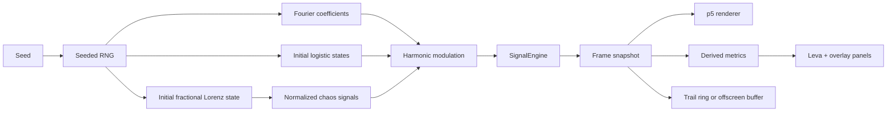

# Fourier + Fractional Chaos Signal Lab

> [!IMPORTANT]
> This repository is a personal laboratory for studying deterministic generative art systems.
> The current app combines seeded Fourier epicycles, a fractional-order Lorenz driver, and per-harmonic logistic modulation into a reproducible environment for visual research.

## Table of Contents

- [Why This Exists](#why-this-exists)
- [What The Lab Currently Does](#what-the-lab-currently-does)
- [Signal Pipeline](#signal-pipeline)
- [Mathematical Ingredients](#mathematical-ingredients)
- [Running The Lab](#running-the-lab)
- [How To Work With It](#how-to-work-with-it)
- [Control Surface Reference](#control-surface-reference)
- [Presets](#presets)
- [Determinism And Reproducibility](#determinism-and-reproducibility)
- [Repository Layout](#repository-layout)
- [Engineering Notes](#engineering-notes)
- [Research Directions](#research-directions)

## Why This Exists

This project is not just a sketch. It is a study environment.

The goal is to explore questions like:

- How does a deterministic Fourier carrier behave when its amplitudes and phases are modulated by chaotic systems?
- What changes when the chaotic driver is smooth and stateful, versus local and per-harmonic?
- Which parameters produce near-periodic structure, blooming trajectories, collapse, divergence, or dense woven trails?
- How can experiments stay reproducible enough to support actual research instead of accidental discovery?

The codebase is organized around a simple idea:

1. Keep the math domain pure and deterministic.
2. Keep runtime evolution inside a single signal engine.
3. Keep rendering and controls separate from the dynamics.

## What The Lab Currently Does

At the moment the app gives you:

- A React + Vite shell with a p5 renderer in instance mode.
- A deterministic Fourier signal built from seeded harmonic coefficients.
- Per-harmonic logistic-map states for fine-grained chaotic modulation.
- An optional fractional-order Lorenz system for low-dimensional continuous chaos.
- A Leva control surface grouped by environment, signal, chaos, runtime, and limits.
- Offscreen trail rendering for long traces.
- Optional epicycle visualization.
- A harmonic inspection panel.
- Derived metrics such as spectral energy and normalized chaos scale.
- Shareable URLs that serialize the current config into the query string.
- PNG export from the current canvas.

> [!TIP]
> The default canvas is large (`4180x2385`). That is good for high-resolution exports, but if you are exploring interactively on a slower machine, reduce `Canvas.width`, `Canvas.height`, or `Render.pixelDensity` first.

## Signal Pipeline



### Runtime flow

On each frame:

1. `SignalEngine` optionally advances the chaotic subsystems.
2. When fractional chaos is enabled, the Lorenz state is normalized and compressed with `tanh`.
3. Each harmonic is evaluated with either neutral modulation or chaos-driven amplitude and phase offsets.
4. The full chain of epicycles is accumulated.
5. The endpoint becomes the newest trail point.
6. Spectral energy metrics are updated.
7. The renderer draws epicycles, trail, and optional overlays.

## Mathematical Ingredients

<details>
<summary><strong>1. Fourier carrier</strong></summary>

The carrier is a deterministic sum of harmonics generated from a seed.

Conceptually:

```text
z(t) = Σ A_k(t) · exp(i · (k · t + φ_k(t)))
```

In implementation terms:

- `createFourierCoefficients()` creates paired positive and negative harmonics.
- Each harmonic stores `k`, `amp0`, `phi0`, `twist1`, `twist2`, and `twist3`.
- `baseAmp`, `decay`, and `ampJitter` shape the spectrum.
- The seed guarantees the same initial coefficient field for the same Fourier config.

</details>

<details>
<summary><strong>2. Logistic micro-chaos</strong></summary>

Each harmonic has its own logistic state:

```text
x_(n+1) = r · x_n · (1 - x_n)
```

Why it matters:

- It introduces fine local variation per harmonic.
- It stays deterministic.
- It can push the output from near-periodic into unstable-looking texture without needing a high-dimensional state.

Relevant controls:

- `Chaos > ChaosLogistic > r`
- `Chaos > ChaosLogistic > mix`

</details>

<details>
<summary><strong>3. Fractional Lorenz driver</strong></summary>

The app includes a short-memory Grunwald-Letnikov style fractional Lorenz integrator.

The classical Lorenz flow is:

```text
dx/dt = σ(y - x)
dy/dt = x(ρ - z) - y
dz/dt = xy - βz
```

This project replaces the standard first-order update with a fractional-order memory term controlled by `alpha`.

Why it matters:

- `alpha` changes the memory profile of the system.
- `memory` changes how much history participates in the update.
- `substeps` controls how many Lorenz updates happen per rendered frame.
- The Lorenz state is normalized before it modulates the Fourier system, which keeps the signal usable even when raw coordinates drift.

Relevant controls:

- `Chaos > ChaosFrac > alpha`
- `Chaos > ChaosFrac > dt`
- `Chaos > ChaosFrac > memory`
- `Chaos > ChaosFrac > substeps`
- `Chaos > ChaosFrac > sigma`, `rho`, `beta`
- `Chaos > ChaosFrac > normScale`

</details>

<details>
<summary><strong>4. Amplitude and phase coupling</strong></summary>

The final modulation blends:

- trigonometric coupling derived from the normalized Lorenz state
- harmonic-specific twist angles
- logistic-state perturbations

Then the engine applies global modulation gains:

- `Chaos > ChaosGain > amp gain`
- `Chaos > ChaosGain > phase gain`

This separation is useful because it lets you keep the chaotic structure active while independently deciding whether the output should read more as:

- geometric displacement
- amplitude bloom
- phase turbulence
- nearly stable drift

</details>

<details>
<summary><strong>5. Spectral energy tracking</strong></summary>

For each frame, the engine accumulates:

- total spectral energy
- an exponential moving average of that energy
- a running peak
- a normalized energy score in `[0, 1]`

This is not just decorative telemetry. It gives you a rough signal-health indicator while you sweep parameters.

</details>

## Running The Lab

### Requirements

- Node.js 18+ is the safe baseline for modern Vite projects.
- `npm`

### Development

```bash
npm install
npm run dev
```

Then open the local Vite URL in your browser.

### Production build

```bash
npm run build
npm run preview
```

## How To Work With It

### A good study loop

1. Start from `Near Periodic` or `Baseline`.
2. Keep `epicycles.show` off at first and read the trail as the primary signal.
3. Turn `fractional on` only after you understand the non-fractional baseline.
4. Sweep one family at a time: first Fourier density and envelope, then logistic regime, then fractional memory and `alpha`, then amplitude and phase gain.
5. Turn on the debug overlay when the output starts behaving unexpectedly.
6. Turn on the harmonics panel if you want to inspect the seeded spectrum.
7. Copy the share URL whenever you find an interesting basin of behavior.
8. Export PNGs only after the motion and composition are stable enough to keep.

### Session actions exposed in the UI

| Action | What it does |
| --- | --- |
| `preset` | Selects a named config patch. |
| `applyPreset` | Merges the selected preset into the current config. |
| `prevSeed` / `nextSeed` / `randomSeed` | Rebuilds the experiment with a new deterministic seed. |
| `resetDynamics` | Resets time, Lorenz state, logistic states, and the trail without resetting the whole config. |
| `resetConfig` | Restores `DEFAULT_CONFIG`. |
| `copyShareUrl` | Serializes the current config into `?cfg=`. |
| `loadFromUrl` | Rehydrates state from the URL. |
| `exportPNG` | Saves the current canvas as a PNG. |

## Control Surface Reference

| Area | Main controls | What they affect |
| --- | --- | --- |
| `Environment > Canvas` | `width`, `height` | Output resolution and export size. |
| `Environment > Render` | `fps`, `pixelDensity`, `background` | Draw cadence, raster density, scene background. |
| `Environment > View` | `scale`, `center x`, `center y` | Camera-like framing of the signal in canvas space. |
| `Signal > Fourier` | `K`, `K min`, `K max`, `K step`, `baseAmp`, `decay`, `ampJitter` | Harmonic count, spectral envelope, and randomness of initial amplitudes. |
| `Signal > Time` | `step`, `speed` | Phase advance per rendered frame. |
| `Signal > Trail` | `max points`, `color`, `weight`, `offscreen layer` | History length, appearance, and whether the trail is accumulated in an offscreen buffer. |
| `Signal > Epicycles` | `show`, circle/link colors, `tip size` | Visibility of the chain-of-circles construction. |
| `Chaos > ChaosFrac` | `alpha`, `dt`, `memory`, `substeps`, `sigma`, `rho`, `beta`, `normScale` | Memory-bearing Lorenz behavior and normalization. |
| `Chaos > ChaosLogistic` | `r`, `mix` | Local chaotic variation applied per harmonic. |
| `Chaos > ChaosGain` | `amp gain`, `phase gain` | Strength of modulation on the Fourier field. |
| `RuntimeAndLimits > Runtime` | `paused`, `chaos on`, `fractional on`, `debug overlay`, `harmonics panel` | Study toggles and diagnostics. |
| `RuntimeAndLimits > Limits` | alpha, memory, speed, scale bounds | Guardrails stored in config and partially enforced by the control mapping. |

### Practical reading of the parameter families

- If you want denser curves, raise `K`.
- If you want more outer harmonics to matter, lower `decay`.
- If the image is too explosive, reduce `amp gain` before touching everything else.
- If the output is too static, raise `logistic mix` or turn on the fractional driver.
- If the Lorenz contribution feels noisy rather than structured, tune `alpha`, `memory`, and `substeps` together instead of in isolation.
- If interaction feels slow, reduce canvas resolution before reducing the trail length.

## Presets

| Preset | Intent | Main patch |
| --- | --- | --- |
| `Baseline` | Start clean from the default config. | No patch. |
| `Phase Twist` | Emphasize phase modulation with a moderate harmonic field. | `K=64`, `decay=0.92`, fractional chaos on, higher phase gain, logistic `r=3.84`. |
| `Amplitude Bloom` | Push richer growth and denser texture. | `K=180`, `baseAmp=80`, `decay=0.75`, `alpha=0.2`, `memory=256`, `substeps=48`, stronger amplitude gain. |
| `Near Periodic` | Stay close to structured repetition. | Fractional chaos off, modest gains, logistic `r≈3.57`, low mix. |

## Determinism And Reproducibility

This lab is deliberately engineered so that "interesting result" and "repeatable result" are not opposites.

| Change | Engine behavior |
| --- | --- |
| Change `seed` | Full reseed of coefficients, logistic states, and Lorenz initialization. |
| Change Fourier config | Full reseed, because the spectral basis changed. |
| Change fractional Lorenz dynamics | Rebuilds the Lorenz integrator while keeping the current state when possible. |
| Toggle runtime pause | Stops state advance without discarding the current system. |
| `resetDynamics` | Keeps config, restarts evolving state. |
| `copyShareUrl` | Encodes the current config as base64 JSON in `?cfg=`. |

> [!NOTE]
> The mutable part of the system lives in `SignalEngine`. The config itself is cloned and frozen before use. That separation is one of the reasons the app stays inspectable.

## Repository Layout

| Path | Role |
| --- | --- |
| `src/domain` | Pure signal logic: Fourier generation, logistic map, fractional Lorenz, modulation, math helpers, config. |
| `src/render` | p5 integration, canvas lifecycle, trail accumulation, overlays, export hooks. |
| `src/ui` | Leva schema, config/control mapping, presets, URL serialization, harmonic table. |
| `src/App.jsx` | Main application shell and orchestration. |
| `script/script.js` | Legacy standalone sketch preserved as historical reference. |
| `README.md` | Primary research-facing documentation. |

<details>
<summary><strong>High-value source files to read first</strong></summary>

- `src/domain/signalEngine.js`
- `src/domain/fractionalLorenz.js`
- `src/domain/chaos.js`
- `src/domain/fourier.js`
- `src/render/createP5Sketch.js`
- `src/ui/controls/schema.js`

</details>

## Engineering Notes

### Current strengths

- The architecture split is clean.
- The signal layer is decoupled from React and p5.
- Seeded determinism is handled intentionally.
- The renderer supports both direct and offscreen trail accumulation.
- The control surface is already organized well enough for real exploration.

### Current gaps or caveats

- There is no automated test suite yet.
- The production bundle is currently large enough for Vite to warn during build.
- `KStep` exists in config and UI state, but it is not yet driving automated sweep behavior.
- Speed limit values are stored, but the current control mapping does not clamp `time.speed` with them.
- The current workspace includes generated artifacts such as `dist/` and installed dependencies in `node_modules/`. If this becomes a long-lived canonical repo, treat those as artifacts rather than core source.

## Research Directions

If this laboratory grows into a broader suite, these are sensible next axes:

- Add more chaotic systems such as Rossler, Henon, Ikeda, Duffing, and Chua.
- Add alternate spectral constructions beyond symmetric positive/negative harmonics.
- Add batch rendering and seed sweeps for comparative studies.
- Add config snapshots and a small experiment journal format.
- Add numeric analysis views such as Lyapunov estimates, recurrence plots, Poincare sections, and parameter sweep heatmaps.
- Add domain-level tests so exploratory refactors do not quietly change the dynamics.

> [!TIP]
> The best near-term expansion is probably not "more UI". It is "more controlled experiments": parameter sweep tooling, saved observations, and additional dynamical systems that can plug into the same deterministic engine.
# fourier-fractional-chaos-explorations
